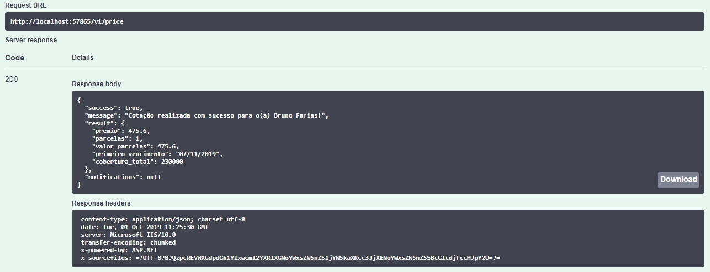
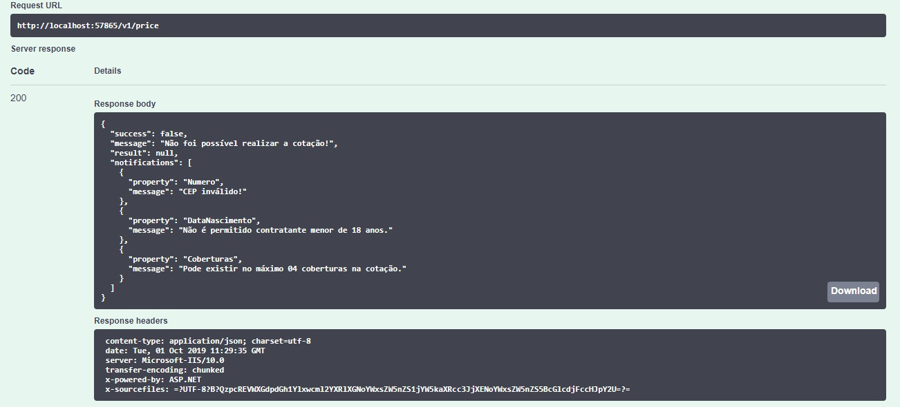

# Desafio CI&T
Objetivo

Criar serviço onde o corretor informa os
dados básicos do futuro segurado e a lista de coberturas nas quais o segurado está
interessado.

Retornar com base nas informações concebidas o _valor do prêmio_, _parcelas_, _valor das parcelas_, _primeiro vencimento_ e o _valor total da cobertura_.

## Serviços disponíveis
`/v1/price` `[Post]`
`/v1/cities` `[Get]`

## Exemplos
`/v1/price`

##### Requisição válida

##### Retorno

---

##### Requisição inválida

##### Retorno

Desenvolvido por Bruno Farias.
